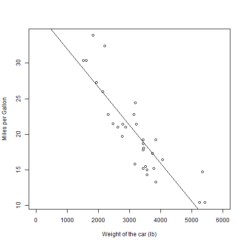

Broad Prediction of MPG by Weight
========================================================
author: Ertuda
date: June, 2015

Rationale of the Project
========================================================


1000 lb is an important concept for auto design. It is given as an expected weight of a car in future car design competitions. This application aims to use a dataset in R base, to come up with a simple linear regression analysis of the relationship of miles per gallon (mpg) to weight of a car. 


Data
========================================================

We fit a simple linear regression model on the dependence of the 
mpg of a car on its weight (wt). The dataset is the mtcars dataset
in base R. 


```r
data(mtcars)
mtcars$wt <- mtcars$wt*1000
fit <- lm(mpg~wt,data=mtcars)
```

Fuel Efficiency vs. Weight
========================================================

Here is a scatter plot and the dependency line predicted by the 
linear regression model. It clearly shows a strong relationship
between the weight of a car and its mpg.

 

Prediction of the MPG of a 1000 pound car
========================================================

As mentioned before, 1000 pound car is an important concept for 
auto design of the future car. One of the reasons for this concept is 
because we want to have the maximum fuel efficiency for the future
cars so that limiter energy sources could be used more efficiently,
providing us a potentially better communities and cities in the future.

As a result of our linear regression model, the predicted mpg of 
a 1000 lb car is; 

```r
predict(fit,data.frame('wt'=1000))
```

```
       1 
31.94065 
```
